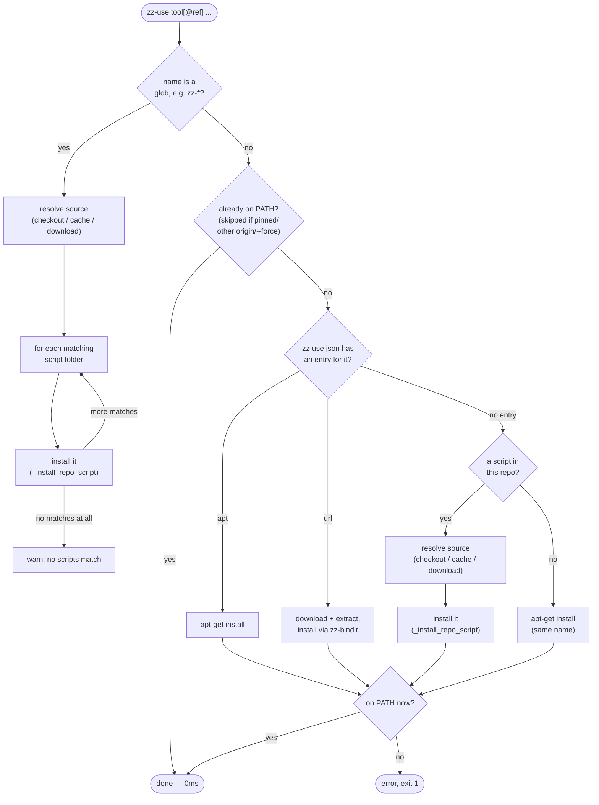

<!-- @format -->

# scripts

Reusable shell scripts shared across
[`tomgrv/devcontainer-features`](https://github.com/tomgrv/devcontainer-features)
(`common-utils` feature) and [`tomgrv/vps`](https://github.com/tomgrv/vps).
Every core `zz-*` script and most functional scripts are POSIX `sh`; a
few functional scripts ported from the original bash implementation
(`json-validate`, `json-normalize`) keep `#!/bin/bash` for now, since
they rely on bash-only features (arrays, `<<<`, `${var//pat/rep}`).

## Layout

One folder per script (an npm workspace), each self-contained:

```
<name>/
  run.sh          # the script; linked onto PATH as `<name>`
  package.json    # {"name": "<name>", "bin": {"<name>": "run.sh"}, ...}
  README.md       # usage + dependencies for this one script
  test.bats       # bats tests for this script
  config/         # optional: resources owned by this script only
                  #   (json-validate/config/, zz-use/config/zz-use.json)
tests/helpers.bash # shared bats setup: links every <name>/run.sh onto PATH
package.json       # npm workspaces root, listing every folder above
setup.sh            # root bootstrapper: temp-downloads the core zz-* scripts
```

Modeled on `tomgrv/actions`' one-folder-per-unit convention (`<action>/`
with its own `action.yml`/`run.sh`/`package.json`), adapted for plain
shell scripts instead of composite GitHub Actions.

## `setup.sh` — root bootstrap

A machine with nothing installed yet needs _something_ fetchable with zero
prerequisites. That's `setup.sh`, kept deliberately dumb and DRY: it
downloads a tarball of this repo to a temp dir, then hands off to the
`zz-use` it just downloaded to install the core `zz-*` bundle from
there — the same bin-dir resolution and linking logic `zz-use` always
uses, not a second copy of it — and discards the temp dir.

```sh
curl -fsSL https://raw.githubusercontent.com/tomgrv/scripts/main/setup.sh | sh
```

Pin it to a tag, branch, or commit instead of `main` with a positional arg
or `ZZ_ORIGIN_REF`, or bootstrap from a different org/repo entirely with
`ZZ_ORIGIN`:

```sh
curl -fsSL .../setup.sh | sh -s -- v2
```

Both are exported for the `zz-use` this hands off to (and anything it
execs), so every `zz-use` call afterwards defaults to this same origin —
wherever this install actually came from — rather than a hardcoded
`tomgrv/scripts`.

That's the only thing that needs fetching up front. Once `zz-use` is on
`PATH`, every other script — core or functional — resolves and installs
its own further dependencies on demand the same way (see `zz-use` below).
Functional scripts themselves aren't installed by `setup.sh` or `zz-use`;
install those directly (`npm install <folder>`, or check out the repo).

## Caching, `zz-update`, and pinning an origin/ref

Both `setup.sh` and `zz-use`'s script installs resolve the same way:
straight from disk when running inside a checkout of this repo, otherwise
from a local cache directory (`ZZ_CACHE_DIR/<org>/<repo>/<ref>`, default
`~/.cache/zz_scripts/tomgrv/scripts/main`) that's populated on first use
and then just linked from on every call after that — no repeat network
round-trip.

`zz-update` forces a fresh download, bypassing the cache, and re-links the
core `zz-*` scripts from it:

```sh
zz-update # or: zz-use --force <tool...>
```

Any tool name accepts an optional `[org/repo/]` prefix and/or `@<ref>`
suffix, to pull it from a different GitHub repo and/or pin it to a
specific tag, branch, or commit instead of this repo's own default
(`ZZ_ORIGIN`, default `tomgrv/scripts`; `ZZ_ORIGIN_REF`, default `main`):

```sh
zz-use json-validate@v2
zz-use someorg/otherscripts/some-tool@v1
```

Each origin+ref gets its own cache slot, so pinning one script doesn't
disturb anything already resolved at the default. A pinned or
other-origin request always (re)installs — unlike a plain, default-origin
request, it's never skipped just because a same-named command is already
on `PATH`, since there's no way to tell from an installed script alone
which repo/ref produced it.

A tool name may also be a glob (e.g. `zz-*`, `git-fix-*`): it expands to
every matching script folder in the resolved source tree, each installed
through the normal per-tool path above. A glob that matches nothing logs a
warning rather than failing:

```sh
zz-use "zz-*" # every core zz-* script, without naming them one by one
```

`-x`/`--exec <tool> [arg...]` installs `<tool>` and execs straight into it
(replacing the current process), passing everything after it through as
its argv. Any tool names given before `-x` are resolved first, as ordinary
dependencies — useful for a thin wrapper script that just wants to
activate its real implementation and hand off to it:

```sh
zz-use zz-log jq -x json-validate some-file.json
# installs zz-log and jq as usual, then installs and execs
# `json-validate some-file.json`
```

## Naming

- **Core** folders keep the `zz-` prefix — each atomic function is its own
  dedicated script: `zz-use`, `zz-update`, `zz-colors`, `zz-log`, `zz-args`,
  `zz-prompt`, `zz-ask`, `zz-menu`, `zz-input`, `zz-bindir`, `zz-dispatch`, `zz-npx`,
  `zz-persist`, `zz-call`, `zz-install`.
- **Functional** folders use `<verb>-<topic>` naming: `json-validate`,
  `json-normalize`, `json-merge`, `json-load`, `resolve-context`,
  `edit-script`, `distribute-utils`, `install-feature`,
  `configure-feature`.

## `zz-use` — the activator

`zz-use` is what every other script calls, once, up front, to declare and
resolve its dependencies — including any other script in this repo, core
or functional:

```sh
zz-use zz-colors zz-args json-load jq git
```

Internally, `run.sh` is a thin wrapper around a `_use()` function that does
the actual resolving, calling `_bindir`, `_install_repo_script`, etc. None
of them need `zz-bindir`, `zz-log`, or any other core script to already be
on `PATH` — but that's not because they each carry a fallback
reimplementation. It's `_resolve_src` doing the one thing that actually
has to happen first: figure out the "tarball context" (a checkout, a warm
cache, or a freshly downloaded tarball — all three are just a directory of
`zz-*/run.sh` siblings) and symlink every script in it onto `PATH` under
its real name, in a throwaway scratch dir. From that point on,
`command -v zz-bindir`, `zz-log ...`, even the `. zz-colors` _inside_
zz-bindir's and zz-log's own source, all just resolve normally — zero
reimplementation of what those scripts do.

`zz-use` itself relies on `zz-log` (and its other core siblings) already
being on `PATH` — that's `setup.sh`'s job (see above): its
`zz-use "zz-*"` call puts the whole core set in place, one script at a
time, before anything else runs. `zz-use` doesn't re-derive that
bootstrapping.

For each `<tool>` requested, in order:

1. `command -v <tool>` — already there, no-op.
2. **Any tool with a `zz-use/config/zz-use.json` entry** (override with
   `ZZ_USE_CONFIG`) — an explicit mapping always wins if a name happens to
   collide with a repo script:
    - `{"apt": "<pkg>"}` → `apt-get install -y <pkg>` (via `sudo` if not root).
    - `{"url": ..., "archive": "tar.gz"|"tar.xz"|"zip"|"raw", "binpath": ...}`
      → download, extract if needed, resolve a writable bin dir via
      `zz-bindir`, and install the binary as `<tool>`. Templates support
      `{VERSION}`, `{OS}` (`uname -s`, lowercased), `{ARCH}` (`amd64`/`arm64`).
3. **Any script from this repo** (a functional script like `json-load`,
   or a core `zz-*` one) — installed individually, the same way whether
   it's core or functional: nothing in this repo needs installing as a
   group. Source is, in order: a sibling `zz-*/run.sh` folder in this
   repo when running from a checkout/npm install; otherwise a local
   cache (see caching below); otherwise a fresh download into that
   cache.
4. No config entry, not a script in this repo → fall back to
   `apt-get install -y <tool>` (same name).
5. Still missing afterwards → error, exit 1.

Idempotent: safe to call on every invocation — resolved tools are skipped
via `command -v` in ~0ms. Retrieval or install happens **if and only if**
the tool isn't already available.

Below is that same per-tool decision path. `-x`/`--exec <tool> [arg...]`
just wraps it: any tools before `-x` go through it as ordinary
dependencies, then `<tool>` itself goes through it too, and once it's on
`PATH`, `zz-use` execs into it instead of returning.



## Core `zz-*` scripts

| Script                                                                 | Purpose                                                                                                                                               |
| ---------------------------------------------------------------------- | ----------------------------------------------------------------------------------------------------------------------------------------------------- |
| `zz-use <tool>[@ref]`                                                  | the activator: resolve/install a dependency, if and only if missing (see below)                                                                       |
| `zz-update`                                                            | force a fresh download of the zz-* bundle, bypassing the local cache                                                                                  |
| `zz-colors`                                                            | ANSI color vars (`$Red` `$Green` ... `$End`); source it: `. zz-colors`                                                                                |
| `zz-log <lvl> <msg...>`                                                | colored, leveled log line on stderr (`i`/`w`/`e`/`s`/`-`)                                                                                             |
| `zz-args <title> <caller> <<-help ...`                                 | parse `$@` per a spec; `eval $(zz-args ...)` to bind the vars                                                                                         |
| `zz-prompt <question> [default]`                                       | interactive free-form input                                                                                                                           |
| `zz-ask <options> <question...>`                                       | interactive single-char confirm                                                                                                                       |
| `zz-menu [-t title] [-d key] [-f footer] [-c states] <key=label>...`   | interactive numbered menu; prints the chosen key (or, with `-c`, each item's cycled `key=state`)                                                      |
| `zz-input [file]`                                                      | read from arg (literal or file) or stdin                                                                                                              |
| `zz-bindir [-t target]`                                                | resolve/create a writable bin dir; `eval $(zz-bindir ...)` to bind `$dir` and extend `PATH`                                                           |
| `zz-dispatch <caller> <subcmd>`                                        | dispatch an underscore-prefixed caller to a sibling `<name>-<subcmd>` script                                                                          |
| `zz-npx [-s] <tool>`                                                   | run a local `node_modules/.bin` binary, falling back to `npx`                                                                                         |
| `zz-persist [-f\|-p] [-i <question> [-v\|-s <default>]] <key> [value]` | upsert a `KEY=VALUE` pair into an env file and/or `/etc/profile.d`; with `-i`, ask interactively instead (`-s` for a secret, masked when already set) |
| `zz-call [-p package.json] [command...]`                               | resolve a caller's declared env vars (`config.input`/`config.output` in `package.json`; ask + persist if missing), then run a command                 |
| `zz-install <pkg> [<manager>=<name>...]`                               | install a system package via apt/apk/dnf/yum/brew/pacman/zypper/winget, with per-manager name overrides                                               |

## Functional scripts

| Script              | Purpose                                                                |
| ------------------- | ---------------------------------------------------------------------- |
| `json`              | dispatch to `json-<subcommand>` (`load`, `validate`, `normalize`, `merge`) |
| `json-load`         | load JSON from a file/URL, tag it with `$id`                           |
| `json-validate`     | validate JSON against a (local/inferred/remote) JSON Schema            |
| `json-normalize`    | sort JSON keys per schema + alphabetically, optional in-place write    |
| `json-merge`        | recursively merge one JSON file into another (arrays deduped, unioned) |
| `resolve-context`   | resolve a feature's source/target dirs from the calling script         |
| `edit-script`       | copy an installed script locally and open it for editing               |
| `distribute-utils`  | copy `zz-*`/utility scripts into a project's local scripts directory   |
| `install-feature`   | copy a feature's stubs/config/bin into a target, run `install-*.sh`    |
| `configure-feature` | deploy a feature's stubs into the cwd (merging), run `configure-*.sh`  |

See each folder's own `README.md` for its usage line.

## Git utilities

Migrated from `tomgrv/devcontainer-features`'s `gitutils` feature (which
used to ship them directly under `src/gitutils/bin/`), mirroring the same
move `common-utils`'s functional scripts made earlier — one source of
truth here, fetched on demand via `zz-use` instead of duplicated per
consumer. Installed as `git-<name>` on `PATH`, so git resolves them as
`git <name>` subcommands (e.g. `git-release-beta` → `git release-beta`).
The `gitutils` feature still owns the config (which aliases like `git
beta`/`git prod` point at which of these) and the git-flow install/config
lifecycle — only the script implementations moved.

| Script                      | Purpose                                                                  |
| --------------------------- | ------------------------------------------------------------------------ |
| `git-align`                 | align the current branch with its remote counterpart                     |
| `git-autorebase`            | non-interactive rebasing with conflict resolution                        |
| `git-co`                    | enhanced commit                                                          |
| `git-degit`                 | clone and degit a repository                                             |
| `git-fix`                   | dispatch to `git-fix-<subcommand>`                                       |
| `git-fix-author`            | set `user.name`/`user.email` to a specified commit's author              |
| `git-fix-base`              | rebase commits from one branch onto another                              |
| `git-fix-blanks`            | discard whitespace/blank/quote-slash-only changes                        |
| `git-fix-children`          | delete all descendant tags and branches of a commit                      |
| `git-fix-date`              | fix commit dates/times in history                                        |
| `git-fix-del`               | delete a specified commit and rebase subsequent history                  |
| `git-fix-emoji`             | fix git emoji                                                            |
| `git-fix-last`              | edit the last commit's message and content                               |
| `git-fix-lock`              | resolve conflicts and regenerate lock files                              |
| `git-fix-message`           | rewrite an arbitrary commit message                                      |
| `git-fix-mode`              | fix file mode changes from diff                                          |
| `git-fix-privacy`           | fix privacy in history                                                   |
| `git-fix-prune`             | prune stale remote-tracking references                                   |
| `git-fix-rights`            | set appropriate file/directory permissions                               |
| `git-fix-secrets`           | redact a secret across git history                                       |
| `git-fix-up`                | amend a commit with current changes and rebase                           |
| `git-forall`                | execute a command for all files in the repository                        |
| `git-hook-commitmsg`        | `commit-msg` hook: apply commitlint + devmoji to the commit message      |
| `git-hook-installplugins`   | install npm plugins declared at a package.json key                       |
| `git-hook-postcheckout`     | `post-checkout` hook                                                     |
| `git-hook-postmerge`        | `post-merge` hook: keep merged lockfiles, prompt to reinstall            |
| `git-hook-precommit`        | `pre-commit` hook: sync lockfiles, run pre-commit checks and lint-staged |
| `git-hook-preparecommitmsg` | `prepare-commit-msg` hook: launch the commitizen prompt                  |
| `git-hook-prepush`          | `pre-push` hook: validate the current branch name                        |
| `git-getcommit`             | list history and ask for a commit to fix up                              |
| `git-integrate`             | integrate modifications from the remote repository                       |
| `git-pick`                  | pick files from a specific commit                                        |
| `git-release`               | dispatch to `git-release-<subcommand>`                                   |
| `git-release-alpha`         | squash-merge the current feature branch into develop                     |
| `git-release-beta`          | start a release branch via Git Flow                                      |
| `git-release-hotfix`        | start a hotfix branch via Git Flow                                       |
| `git-release-prod`          | finish a release/hotfix branch via Git Flow                              |
| `git-unset`                 | unset all git config keys starting with a given prefix                   |
| `git-workspaces`            | list workspace directories and affected workspaces                       |
| `php-list-changed`          | list PHP test parts (core/modules/packages) affected by a change         |

## Usage

Install the whole workspace, or a single script's own package:

```sh
npm install --save-dev @tomgrv/scripts # everything
# or, e.g.:
npm install --save-dev ./json-validate # just this one, standalone
```

Every functional script is self-contained: `zz-use zz-colors zz-args ...`
resolves its own dependencies (installing any missing `zz-*` or external
tool on first use), then `. zz-colors` picks up the color vars.
Any single folder can be copied out and still work standalone.

## Tests

```sh
npm test                     # bats --recursive . (every */test.bats)
bats json-validate/test.bats # a single script's tests
```

Each `test.bats` is a behavioral suite, not just a syntax check: it exercises
the script's documented options and arguments, `-h`/help output, error paths
(missing/invalid arguments, running outside a git repo where relevant), and
success paths against a throwaway git repo or temp directory created in
`setup()`/`teardown()` (via `tests/helpers.bash`). Suites are hermetic — no
network access and no writes outside a temp dir — except where a script's own
purpose requires reaching a real tool (e.g. `zz-npx`/`zz-update` fall back to
a local fixture and assert no network call is made). 417 tests currently pass
across all 53 script folders.

### CI

`.github/workflows/validate-workspace-tests.yml` discovers every workspace (via
[`tomgrv/actions/list-packages`](https://github.com/tomgrv/actions/tree/main/list-packages))
and runs each one's `package.json` `scripts.test` entry
(`bats test.bats`) via
[`tomgrv/actions/run-workspace-tests`](https://github.com/tomgrv/actions/tree/main/run-workspace-tests),
in a matrix — one job per workspace instead of one `bats --recursive .`
job for the whole repo.
